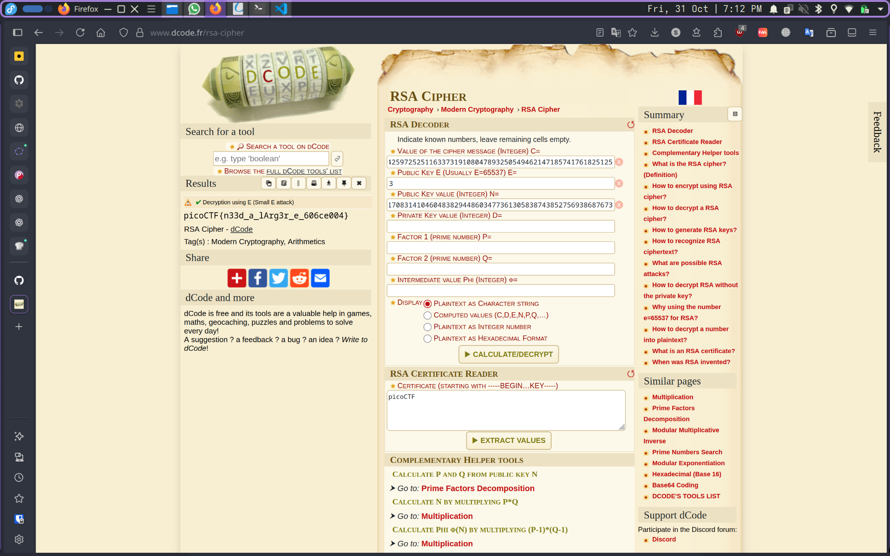

# 1. rsa_oracle

## Description:

Can you abuse the oracle? An attacker was able to intercept communications between a bank and a fintech company. They managed to get the [message](C/secret.enc) (ciphertext) and the [password](C/password.enc) that was used to encrypt the message. After some intensive reconassainance they found out that the bank has an oracle that was used to encrypt the password and can be found here `nc titan.picoctf.net 65450`. Decrypt the password and use it to decrypt the message. The oracle can decrypt anything except the password.

## Solution:

By taking the help of the hint `Crytography Threat models: chosen plaintext attack.`, if we google `RSA chosen plaintext attack.` and look at the first result, we will find a post on the [crypto stackexchange](https://crypto.stackexchange.com/questions/2323/how-does-a-chosen-plaintext-attack-on-rsa-work).


Following the solution given in the post should give us the flag.

First, we start by encrypting `2` using the oracle.

```sh
$ nc titan.picoctf.net 54841
*****************************************
****************THE ORACLE***************
*****************************************
what should we do for you? 
E --> encrypt D --> decrypt. 
E
enter text to encrypt (encoded length must be less than keysize): 2
2

encoded cleartext as Hex m: 32

ciphertext (m ^ e mod n) 4707619883686427763240856106433203231481313994680729548861877810439954027216515481620077982254465432294427487895036699854948548980054737181231034760249505

```
This will give us `4707619883686427763240856106433203231481313994680729548861877810439954027216515481620077982254465432294427487895036699854948548980054737181231034760249505`.

Then, we must multiply it with the encrypted password `2336150584734702647514724021470643922433811330098144930425575029773908475892259185520495303353109615046654428965662643241365308392679139063000973730368839`. to do this, we can use this [big number calculator](https://www.calculator.net/big-number-calculator.html).


Then we can use `tr` to remove the `,`s.

```sh
echo 10,997,708,943,982,761,084,006,315,359,417,483,254,965,299,487,204,584,192,712,335,192,036,789,472,336,196,626,179,282,134,890,223,733,758,401,125,471,056,267,054,908,321,079,024,432,384,222,437,910,457,194,483,711,112,753,102,678,178,170,094,968,585,207,806,212,096,960,492,328,042,941,752,878,907,452,001,886,104,974,213,833,155,189,826,877,814,877,017,136,978,779,880,432,127,774,578,986,380,439,317,174,695 | tr -d ,
10997708943982761084006315359417483254965299487204584192712335192036789472336196626179282134890223733758401125471056267054908321079024432384222437910457194483711112753102678178170094968585207806212096960492328042941752878907452001886104974213833155189826877814877017136978779880432127774578986380439317174695
```

We must now decrypt the resultant number using the oracle.

```sh
what should we do for you? 
E --> encrypt D --> decrypt. 
D
Enter text to decrypt: 10997708943982761084006315359417483254965299487204584192712335192036789472336196626179282134890223733758401125471056267054908321079024432384222437910457194483711112753102678178170094968585207806212096960492328042941752878907452001886104974213833155189826877814877017136978779880432127774578986380439317174695
decrypted ciphertext as hex (c ^ d mod n): a9573f66360
decrypted ciphertext: 
söc`
```

Now, we must divide the hex value `a9573f66360` with the hex of the ascii representation of 2 which is `32`. For this, we can use this [hex calculator](https://www.calculator.net/hex-calculator.html?)


If we now convert the hex value `3630663530` into ascii, we will get the key `60f50` which we can use to obtain the flag.

```sh
$ openssl enc -aes-256-cbc -d -in secret.enc -k 60f50
*** WARNING : deprecated key derivation used.
Using -iter or -pbkdf2 would be better.
picoCTF{su((3ss_(r@ck1ng_r3@_60f50766}%
```

## Flag:

```
picoCTF{su((3ss_(r@ck1ng_r3@_60f50766}
```

## Concepts learnt:

- plaintext attacks on RSA

***

# 2. Custom Encryption

## Description:

Can you get sense of this code file and write the function that will decode the given encrypted file content. Find the encrypted file here [flag_info](C/enc_flag) and [code file](C/custom_encryption.py) might be good to analyze and get the flag.

## Solution:

In this challenge, we have been provided with a python file that is supposed to perform a custom encryption algorithm. To get the flag, we must analyse the code to understand what it does and then reverse it.


<details closed>
<summary><i>Encryption code</i></summary>

```py
 1  from random import randint
 2  import sys
 3
 4
 5  def generator(g, x, p):
 6      return pow(g, x) % p
 7
 8
 9  def encrypt(plaintext, key):
10      cipher = []
11      for char in plaintext:
12          cipher.append(((ord(char) * key*311)))
13      return cipher
14
15
16  def is_prime(p):
17      v = 0
18      for i in range(2, p + 1):
19          if p % i == 0:
20              v = v + 1
21      if v > 1:
22          return False
23      else:
24          return True
25
26
27  def dynamic_xor_encrypt(plaintext, text_key):
28      cipher_text = ""
29      key_length = len(text_key)
30      for i, char in enumerate(plaintext[::-1]):
31          key_char = text_key[i % key_length]
32          encrypted_char = chr(ord(char) ^ ord(key_char))
33          cipher_text += encrypted_char
34      return cipher_text
35
36
37  def test(plain_text, text_key):
38      p = 97
39      g = 31
40      if not is_prime(p) and not is_prime(g):
41          print("Enter prime numbers")
42          return
43      a = randint(p-10, p)
44      b = randint(g-10, g)
45      print(f"a = {a}")
46      print(f"b = {b}")
47      u = generator(g, a, p)
48      v = generator(g, b, p)
49      key = generator(v, a, p)
50      b_key = generator(u, b, p)
51      shared_key = None
52      if key == b_key:
53          shared_key = key
54      else:
55          print("Invalid key")
56          return
57      semi_cipher = dynamic_xor_encrypt(plain_text, text_key)
58      cipher = encrypt(semi_cipher, shared_key)
59      print(f'cipher is: {cipher}')
60
61
62  if __name__ == "__main__":
63      message = sys.argv[1]
64      test(message, "trudeau")
```

</details>

The scipt seems to first apply a modified version of the Diffie-Hellman algorithm  with `p=97`, `g=31` and `a` and `b` are randomly generated to generate a `shared_key`. Then, it reverses the text and applies a short repeated XOR cipher to it with the key `trudeau`. After all this, it converts each character into an integer and mutiplies iit by `(shared_key * 311)`.

To get back the original flag text, we must first compute `shared_key` by following the steps given in the script with `a=94` and `b=21`.Then, we must divide each integer in the cipher by `(shared_key * 311)` and convert it back into characters. This will give us back the `semi_cipher`.

Now, if we again XOR the resulatant `semi_cipher` with the key `trudeau` and then reverse the result, that should give us back the flag text.

To perform this, we can easily modify the original script as follows:

[custom_decryption.py](C/custom_decryption.py)

<details closed>
<summary><i>Decryption code</i></summary>

```py
from random import randint
import sys

cipher = [131553, 993956, 964722, 1359381, 43851, 1169360, 950105, 321574, 1081658, 613914, 0, 1213211, 306957, 73085, 993956, 0, 321574, 1257062, 14617, 906254, 350808, 394659, 87702, 87702, 248489, 87702, 380042, 745467, 467744, 716233, 380042, 102319, 175404, 248489]

def generator(g, x, p):
    return pow(g, x) % p


def decrypt(cipherlist, key):
    semi_cipher = []
    for char in cipherlist:
        semi_cipher.append(((char // (key*311))))
    return ''.join(chr(v) for v in semi_cipher)


def is_prime(p):
    v = 0
    for i in range(2, p + 1):
        if p % i == 0:
            v = v + 1
    if v > 1:
        return False
    else:
        return True


def dynamic_xor_decrypt(plaintext, text_key):
    cipher_text = ""
    key_length = len(text_key)
    for i, char in enumerate(plaintext[::-1]):
        key_char = text_key[i % key_length]
        encrypted_char = chr(ord(char) ^ ord(key_char))
        cipher_text += encrypted_char
    return cipher_text


def test(text_key):
    p = 97
    g = 31
    if not is_prime(p) and not is_prime(g):
        print("Enter prime numbers")
        return
    a = 94
    b = 21
    print(f"a = {a}")
    print(f"b = {b}")
    u = generator(g, a, p)
    v = generator(g, b, p)
    key = generator(v, a, p)
    b_key = generator(u, b, p)
    shared_key = None
    if key == b_key:
        shared_key = key
    else:
        print("Invalid key")
        return
    semi_cipher = decrypt(cipher, shared_key)
    flag = dynamic_xor_decrypt(semi_cipher[::-1], text_key)[::-1]
    print(f'flag is: {flag}')


if __name__ == "__main__":
    test("trudeau")
```

</details>

This will give us the flag `picoCTF{custom_d2cr0pt6d_8b41f976}`.

## Flag:

```
picoCTF{custom_d2cr0pt6d_8b41f976}
```

## Concepts learnt:

- Diffie-Hellman algorithm

## Resources:

- [Secret Key Exchange (Diffie-Hellman) - Computerphile](https://www.youtube.com/watch?v=NmM9HA2MQGI)
- [Diffie-Hellman Key Exchange: How to Share a Secret](https://www.youtube.com/watch?v=85oMrKd8afY)

***

# 3. miniRSA

## Description:

Let's decrypt this: [ciphertext](C/ciphertext)? Something seems a bit small.

## Solution:

In this challenge, we have been given the values relating to an RSA. As we can observe, the given e value is very small which means that the cipher is vulnerable to a `Wiener attack`.

```
N: 29331922499794985782735976045591164936683059380558950386560160105740343201513369939006307531165922708949619162698623675349030430859547825708994708321803705309459438099340427770580064400911431856656901982789948285309956111848686906152664473350940486507451771223435835260168971210087470894448460745593956840586530527915802541450092946574694809584880896601317519794442862977471129319781313161842056501715040555964011899589002863730868679527184420789010551475067862907739054966183120621407246398518098981106431219207697870293412176440482900183550467375190239898455201170831410460483829448603477361305838743852756938687673
e: 3

ciphertext (c): 2205316413931134031074603746928247799030155221252519872649649212867614751848436763801274360463406171277838056821437115883619169702963504606017565783537203207707757768473109845162808575425972525116337319108047893250549462147185741761825125 
```

By using the `RSA Cipher` tool on [dcode.fr](https://www.dcode.fr/en), we can easily get the flag.



## Flag:

```
picoCTF{n33d_a_lArg3r_e_606ce004}
```

## Concepts learnt:

- Why a small e value is dangerous
- Wiener attack

## Resources:

- [The RSA Encryption Algorithm (1 of 2: Computing an Example)](https://www.youtube.com/watch?v=4zahvcJ9glg)
- [The RSA Encryption Algorithm (2 of 2: Generating the Keys)](https://www.youtube.com/watch?v=oOcTVTpUsPQ)
- [dcode.fr/rsa-cipher](https://www.dcode.fr/rsa-cipher)
