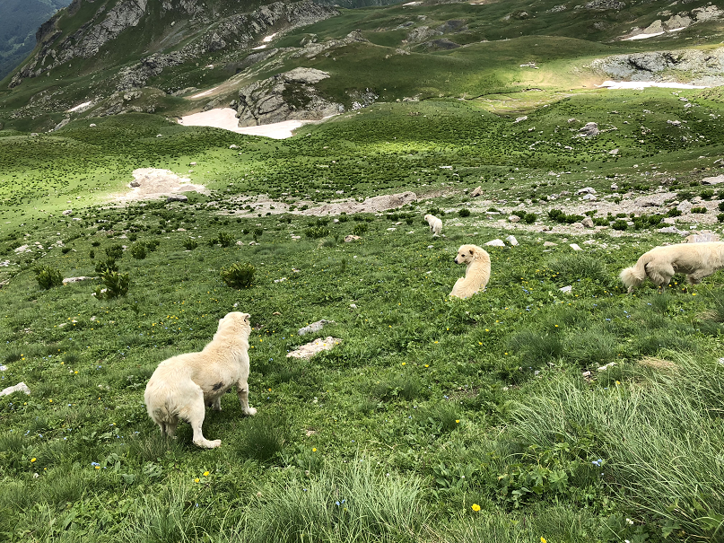
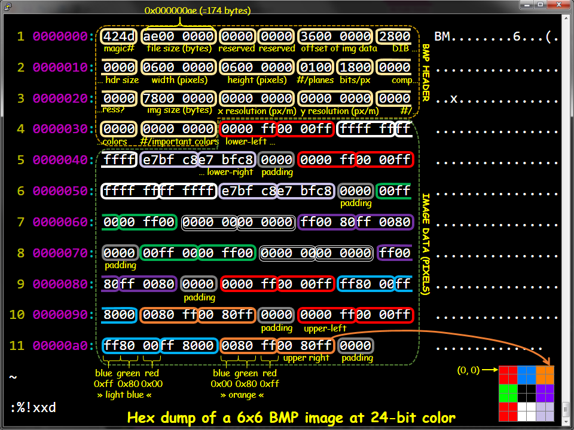
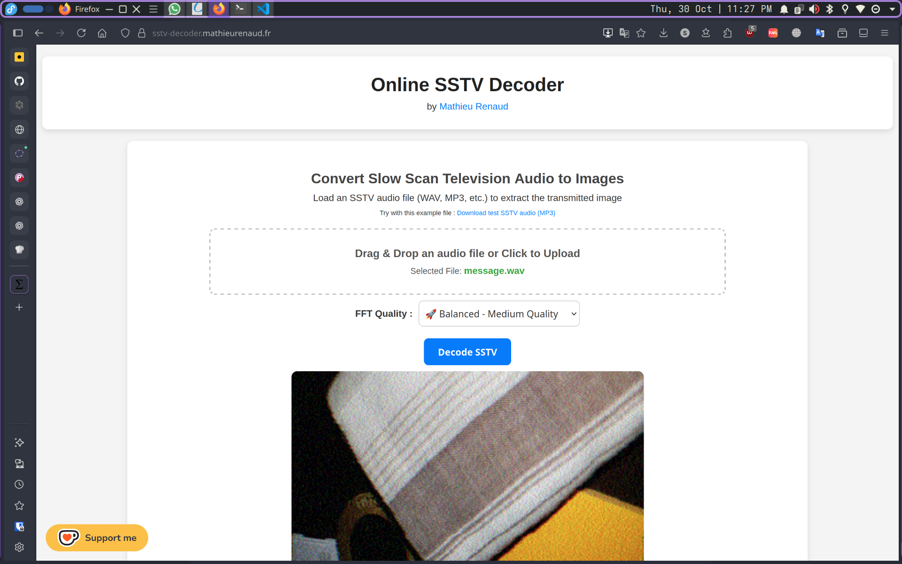
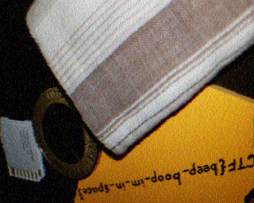

# 1. Trivial Flag Transfer Protocol

## Description:

Figure out how they moved the [flag](F/tftp.pcapng).

## Solution:

For this challenge, we can't use the latest version of `wireshark`. but rather, we must use an older version such as `4.4.5`. We have been provided with a `.pcapng` file which we must open in wireshark to analyse. Then, we can export all the tftp objects by going to `File>Export Objects>TFTP...` in the global menu and selecting any suitable location.

This will give us the following files:

[instructions.txt](F/TFTP/instructions.txt)

[plan](F/TFTP/plan)

[program.deb](F/TFTP/program.deb)




If we open `instructions.txt`, then we will see the following text: `GSGCQBRFAGRAPELCGBHEGENSSVPFBJRZHFGQVFTHVFRBHESYNTGENAFSRE.SVTHERBHGNJNLGBUVQRGURSYNTNAQVJVYYPURPXONPXSBEGURCYNA`.

If we paste this text into `CyberChef` and use the `Rot13` operation, we will get the text `TFTPDOESNTENCRYPTOURTRAFFICSOWEMUSTDISGUISEOURFLAGTRANSFER.FIGUREOUTAWAYTOHIDETHEFLAGANDIWILLCHECKBACKFORTHEPLAN`.

On making it more readable, it will look like this: `TFTP doesn't encrypt our traffic so we must disguise our flag transfer. Figure out a way to hide the flag and i will check back for the plan`

Now, if we open the `plan` file, we will see: `VHFRQGURCEBTENZNAQUVQVGJVGU-QHRQVYVTRAPR.PURPXBHGGURCUBGBF`.

Applying the same operation on it, we get `IUSEDTHEPROGRAMANDHIDITWITH-DUEDILIGENCE.CHECKOUTTHEPHOTOS`

On making it more readable, it will look like this: `I used the program and hid it with - DUEDILIGENCE. Check out the photos`

If we try to look inside the `program.deb` file, we will be able to see that it is actually just the `steghide` program.

If we try to use the `steghide` program to extract all three images using the key `DUEDILIGENCE`, we will get:

```sh
$ steghide extract -sf picture1.bmp -p DUEDILIGENCE
steghide: could not extract any data with that passphrase!
$ steghide extract -sf picture2.bmp -p DUEDILIGENCE
steghide: could not extract any data with that passphrase!
$ steghide extract -sf picture3.bmp -p DUEDILIGENCE
wrote extracted data to "flag.txt".
$ cat flag.txt 
picoCTF{h1dd3n_1n_pLa1n_51GHT_18375919}
```

Hence, the flag will be captured.

## Flag:

```
picoCTF{h1dd3n_1n_pLa1n_51GHT_18375919}
```

## Concepts learnt:

- Basic Wireshark usage
- Basic TFTP
- Basic steghide usage

***

# 2. tunn3l v1s10n

## Description:

We found this [file](F/tunn3l_v1s10n). Recover the flag.

## Solution:

In this challenge, we have been given a file without any extension. We can try to use `exiftool` to view its metadata.

```sh
$ exiftool F/tunn3l_v1s10n 
ExifTool Version Number         : 13.10
File Name                       : tunn3l_v1s10n
Directory                       : F
File Size                       : 2.9 MB
File Modification Date/Time     : 2025:10:29 23:37:32+05:30
File Access Date/Time           : 2025:10:30 23:54:58+05:30
File Inode Change Date/Time     : 2025:10:29 23:38:32+05:30
File Permissions                : -rw-r--r--
File Type                       : BMP
File Type Extension             : bmp
MIME Type                       : image/bmp
BMP Version                     : Unknown (53434)
Image Width                     : 1134
Image Height                    : 306
Planes                          : 1
Bit Depth                       : 24
Compression                     : None
Image Length                    : 2893400
Pixels Per Meter X              : 5669
Pixels Per Meter Y              : 5669
Num Colors                      : Use BitDepth
Num Important Colors            : All
Red Mask                        : 0x27171a23
Green Mask                      : 0x20291b1e
Blue Mask                       : 0x1e212a1d
Alpha Mask                      : 0x311a1d26
Color Space                     : Unknown (,5%()
Rendering Intent                : Unknown (826103054)
Image Size                      : 1134x306
Megapixels                      : 0.347
```

We can see that the image is a bitmap file. We can view its header using xxd.

```sh
$ xxd F/tunn3l_v1s10n | head -n 5
00000000: 424d 8e26 2c00 0000 0000 bad0 0000 bad0  BM.&,...........
00000010: 0000 6e04 0000 3201 0000 0100 1800 0000  ..n...2.........
00000020: 0000 5826 2c00 2516 0000 2516 0000 0000  ..X&,.%...%.....
00000030: 0000 0000 0000 231a 1727 1e1b 2920 1d2a  ......#..'..) .*
00000040: 211e 261d 1a31 2825 352c 2933 2a27 382f  !.&..1(%5,)3*'8/
```
We can compare this with an online source such as [this](https://engineering.purdue.edu/ece264/17au/hw/HW15).

```c
typedef struct {             // Total: 54 bytes
  uint16_t  type;             // Magic identifier: 0x4d42
  uint32_t  size;             // File size in bytes
  uint16_t  reserved1;        // Not used
  uint16_t  reserved2;        // Not used
  uint32_t  offset;           // Offset to image data in bytes from beginning of file (54 bytes)
  uint32_t  dib_header_size;  // DIB Header size in bytes (40 bytes)
  int32_t   width_px;         // Width of the image
  int32_t   height_px;        // Height of image
  uint16_t  num_planes;       // Number of color planes
  uint16_t  bits_per_pixel;   // Bits per pixel
  uint32_t  compression;      // Compression type
  uint32_t  image_size_bytes; // Image size in bytes
  int32_t   x_resolution_ppm; // Pixels per meter
  int32_t   y_resolution_ppm; // Pixels per meter
  uint32_t  num_colors;       // Number of colors  
  uint32_t  important_colors; // Important colors 
} BMPHeader;
```



We can see that the `offset` and the `dib_header_size` in the given file are incorrect. We can correct them by using a hex editor to replace them to thier correct values. This change will allow the new image to be opened.


In this image, we will be able to see a fake flag. This atleast shows us that we are moving in the right direction.

If we take another look at the exiftool output or the header, we can see that the image has a resolution of `1134x306`. This seems suspiciously low for a file that takes up around 2.9 Megabytes.

We can see its exact size using `wc`.

```sh
$ wc F/mod1.bmp 
  17140   89905 2893454 F/mod1.bmp
```

As we can see, the file is actually `2893454` bytes long. The header of a bitmap file takes up `54` bytes. Which means, there must be `2893400` bytes of data. If we look at the `exiftool` output again, we can see that `Bit Depth=24`. This means that each pixel will be `3` bytes long. There will also be `2` bytes of padding after each row.

For now, if we initially assume that the width of the image is correct, then we can calculate that each row will take up `3404` bytes `((no. of pixels * 3) + 2)`. From this, we can calculate that the height should be of `850` bytes.

Now, we can correct the height of the image using a hex editor.


Now, we can see the flag.

## Flag:

```
picoCTF{qu1t3_a_v13w_2020}
```

## Concepts learnt:

- BMP file format

***

# 3. m00nwalk

## Description:

Decode this [message](F/message.wav) from the moon.

## Solution:

In this challenge, we have been given a `.wav` file. If we take a look at the first hint, it says `How did pictures from the moon landing get sent back to Earth?`.

On googling this, we will find out about something called `Slow-Scan Television (SSTV)`. We can then find an online SSTV decoder such as [this](https://sstv-decoder.mathieurenaud.fr/) to decode the `.wav` file.



This will give us a `.png` image from where we can see the flag `picoCTF{beep_boop_im_in_space}`.



## Flag:

```
picoCTF{beep_boop_im_in_space}
```

## Concepts learnt:

- They used SSTV to transmit the pictures from the moon landing
