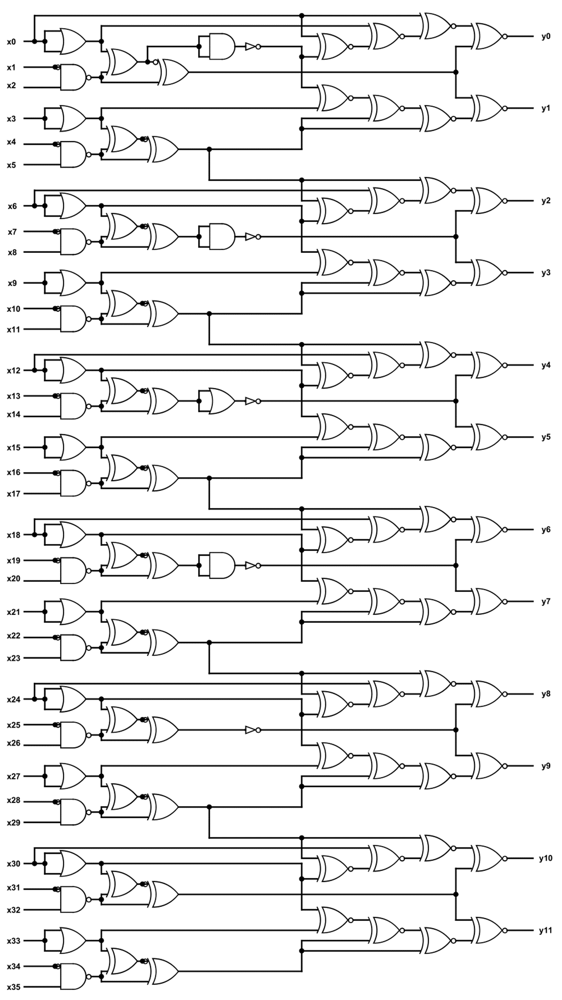

# 1. IQ Test

## Description:

let your input x = 30478191278.

wrap your answer with nite{ } for the flag.

As an example, entering x = 34359738368 gives (y0, ..., y11), so the flag would be nite{010000000011}.



## Solution:


## Flag:

```
picoCTF{}
```

## Concepts learnt:

- 

***

# 2. 

## Description:


## Solution:


## Flag:

```
picoCTF{}
```

## Concepts learnt:

- 

***

# 3. 

## Description:


## Solution:


## Flag:

```
picoCTF{}
```

## Concepts learnt:

- 
